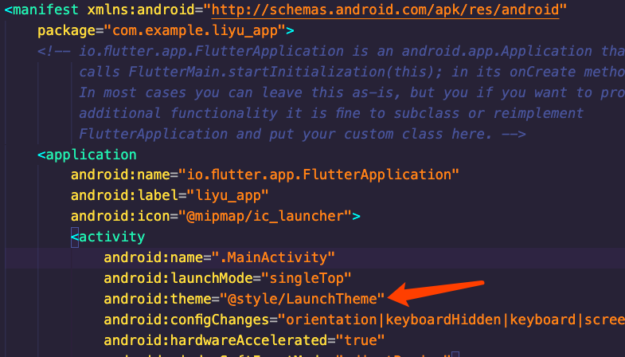
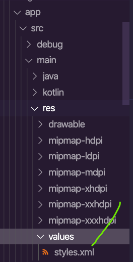
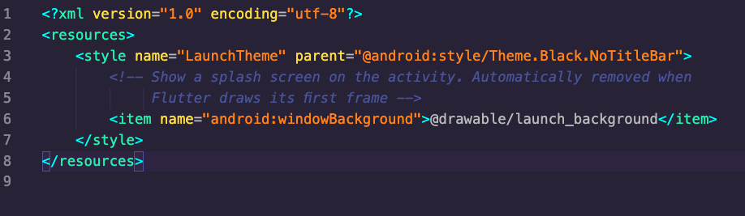
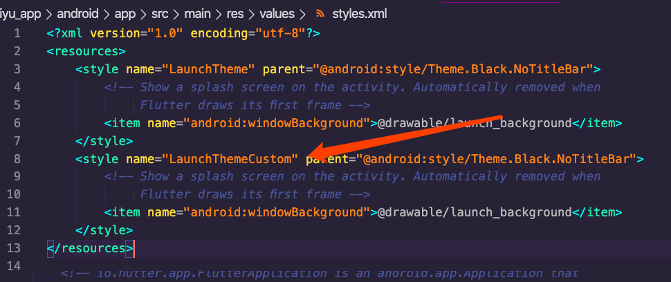
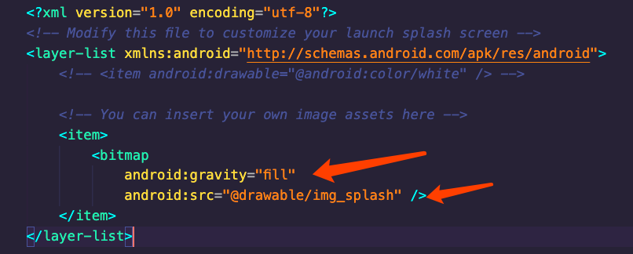

# 启动页面
在app启动时，会遇到从程序运行开始，到第一个 FlutterActivity 被展示之前，会有一定的时间间隔，Flutter默认的话，是显示一个白色空白页面，用户体验度不好。

## android进行修改
android默认在AndroidManifest.xml中设置了一个默认主题的启动页。

LaunchTheme的主题是在Values/styles.xml中进行的配置。

打开以后显示为:

其中style中name为主题的名称，供外部使用。如果需要自定义自己的启动主题内容，可以在styles.xml文件中添加新的主题.然后再在AndroidManifest.xml中将主题设置配置到新添加的主题。

最终此主题是根据res/drawable/launch_background.xml中的配置进行展示的。其默认展示的是白色面板。

由于设置的启动页图片可能会有拉伸变形，所以直接将图片放入到drawable资源中，然后配置launch_background.xml中为

## IOS设置启动页面

此设置比较简单，需要借助xcode进行设置。在xcode中，.../ios/Runner 下选择Assets.xcassets/LaunchImage.imageset，直接拖入文件到相应的分辨率即可。