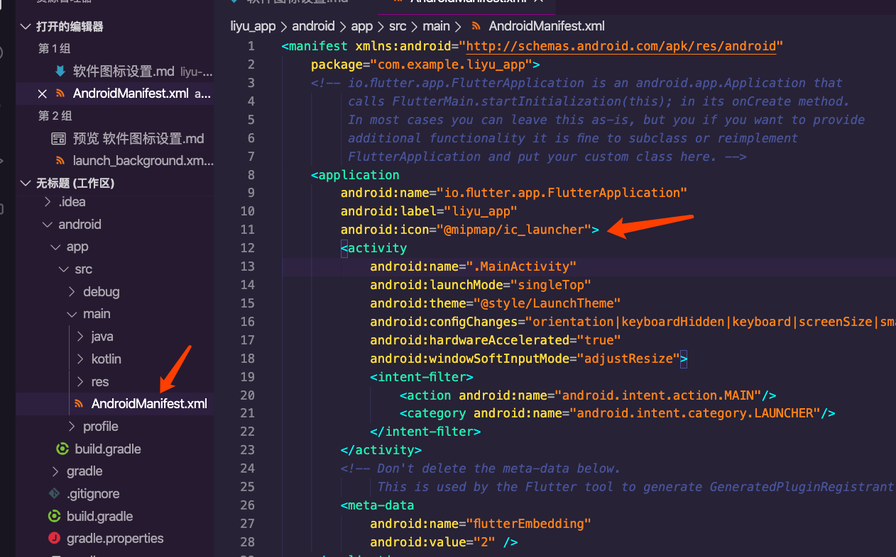

# 软件桌面icon设置
分为Android和IOS两个平台的设置方式。在app中使用到的不同分辨率的icon资源可以在[在线生成不同icon资源](http://icon.wuruihong.com/ "图标工厂")自动生成。

## Android替换图片
在项目文件目录 android/app/src/main/res/下找到mipmap-xxdpi文件夹下，替换其文件即可。**文件名称必须保持一致**

如果想改变mipmap-xxdpi文件夹下的icon名称，需要在AndroidManifest.xml中的application标签的android:icon设置相应的名称

最终在手机上展示的效果为如下图:

##IOS设置桌面icon图标
此只需要将资源直接替换就行。

替换路径为项目文件目录 ios/Runner/Assets.xcassets/AppIcon.appiconset下的所有文件。

包括资源文件下的Contents.json。

项目启动后，桌面图标如下图：

